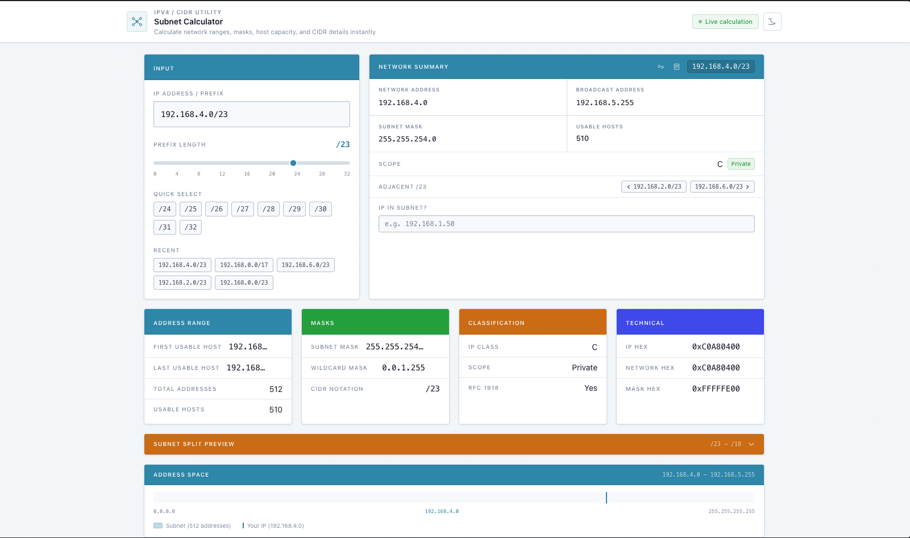

# Subnet Calculator

A fast, client-side IPv4 subnet / CIDR calculator built for network engineers. Enter an IP and prefix and get everything you need — network details, binary breakdown, subnet splits, and more.

**Live demo:** https://subnet-calculator-jade.vercel.app



## Features

**Core calculations**
- Network address, broadcast address, subnet mask, wildcard mask
- First and last usable host, total addresses, usable host count
- IP class (A–E) with classful legacy note, RFC 1918 private/public detection
- Correct handling of /31 (RFC 3021 point-to-point) and /32 (single host route)

**Input & navigation**
- Prefix length slider (0–32) with quick-select buttons for common prefixes
- Adjacent subnet navigation — step to the previous or next subnet at the same prefix with one click
- Recent history — last 8 unique subnets stored in `localStorage`, clickable chips to restore
- `/` keyboard shortcut — press `/` from anywhere to focus the input field
- Shareable URLs — every calculation is encoded in `?q=` so links work out of the box

**Utilities**
- IP-in-subnet checker — type any IP to instantly verify if it falls within the current subnet
- Subnet split preview — divide the current subnet into smaller ones (up to /32), grid of all resulting subnets, capped at 512
- Copy individual fields to clipboard on hover
- Copy full plaintext report (all fields) to clipboard in one click
- Share link button — copies the current URL directly

**Visual**
- Address-space bar — shows where the subnet sits in the 0.0.0.0–255.255.255.255 range
- Binary breakdown table — 32-bit binary for IP, mask, network, and broadcast with network/host bits colour-coded
- Dark mode (default) and light mode with a toggle, persisted in `localStorage`

## Tech Stack

| Tool | Purpose |
|------|---------|
| [Vite 6](https://vite.dev) | Build tool & dev server |
| [React 19](https://react.dev) | UI framework |
| [TypeScript 5.7](https://typescriptlang.org) | Type safety |
| [Tailwind CSS v4](https://tailwindcss.com) | Styling with custom design tokens |
| [Vitest 3](https://vitest.dev) | Unit testing |

## Run locally

```bash
npm install
npm run dev        # development server → http://localhost:5173
npm run build      # production build
npm run preview    # preview the production build
```

## Tests

```bash
npm run test
```

All subnet math lives in `src/lib/subnet.ts` as pure functions with no external dependencies. The test suite covers normal cases, edge cases (/0, /31, /32), boundary octets (0.0.0.0, 255.255.255.255), private/public detection, adjacent subnet boundaries, subnet splitting, and invalid input.

## License

MIT
